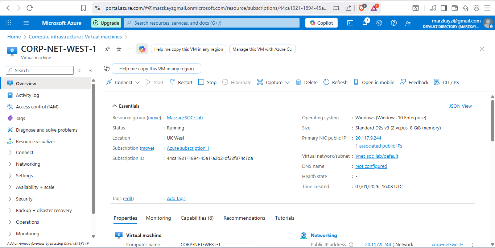
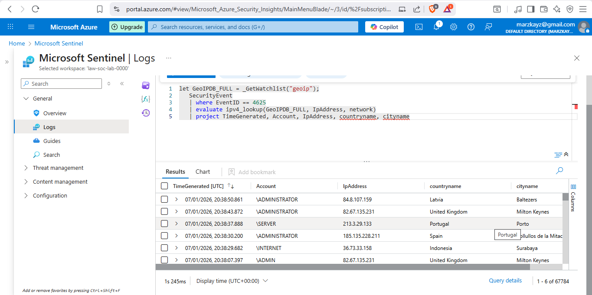
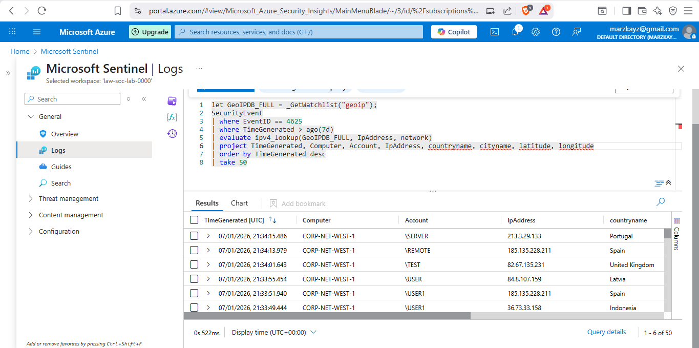

# Azure Sentinel SIEM + Honeypot Lab


## 🎯 Project Overview

Built a cloud-based Security Information and Event Management (SIEM) system using Microsoft Sentinel to monitor and visualize real-time cyber attacks against a honeypot VM deployed in Azure. This project demonstrates end-to-end security monitoring, log analytics, threat intelligence, and attack visualization.

## 🚀 Key Achievements

- Deployed Windows 10 honeypot VM in Azure, intentionally exposed to attract real-world attackers
- Configured Microsoft Sentinel (cloud-native SIEM) for centralized log collection and analysis
- Implemented log forwarding using Azure Monitor Agent (AMA) and Data Collection Rules (DCR)
- Enriched security logs with geolocation data from 54,000+ IP address blocks
- Built interactive attack map visualizing failed RDP attempts from around the world
- Performed threat hunting using KQL (Kusto Query Language) to analyze security events

## 🏗️ Architecture
```
┌─────────────────┐         ┌──────────────────┐         ┌─────────────────┐
│                 │         │                  │         │                 │
│  Internet       │────────▶│  Honeypot VM     │────────▶│  Log Analytics  │
│  (Attackers)    │         │  (All Ports Open)│         │  Workspace      │
│                 │         │  Windows 10      │         │                 │
└─────────────────┘         └──────────────────┘         └─────────────────┘
                                                                    │
                                                                    ▼
                            ┌──────────────────────────────────────────────┐
                            │        Microsoft Sentinel (SIEM)              │
                            │  - Security Event Analysis                    │
                            │  - KQL Queries                                │
                            │  - GeoIP Enrichment (Watchlist)               │
                            │  - Attack Map Workbook                        │
                            └──────────────────────────────────────────────┘
```

## 🛠️ Technologies Used

- **Cloud Platform:** Microsoft Azure
- **SIEM:** Microsoft Sentinel
- **Log Management:** Azure Log Analytics Workspace (LAW)
- **Monitoring:** Azure Monitor Agent (AMA)
- **Query Language:** KQL (Kusto Query Language)
- **Threat Intelligence:** GeoIP Database (54K+ IP blocks)
- **Virtualization:** Azure Virtual Machines
- **OS:** Windows 10 Pro

## 📋 Lab Setup Steps

### Part 1: Azure Environment Setup
1. Created free Azure subscription
2. Configured resource group and networking

### Part 2: Honeypot VM Deployment
1. Deployed Windows 10 VM with public IP
2. Modified Network Security Group (NSG) to allow ALL inbound traffic
3. Disabled Windows Firewall completely (simulating misconfigured system)
4. VM intentionally exposed to attract attackers

### Part 3: Security Event Collection
1. Configured Windows Event Viewer to capture security logs
2. Generated test failed login events (Event ID 4625)
3. Validated local event logging before forwarding

### Part 4: Log Forwarding & Centralization
1. Created Azure Log Analytics Workspace (LAW)
2. Deployed Microsoft Sentinel instance
3. Configured "Windows Security Events via AMA" data connector
4. Set up Data Collection Rules (DCR) for log forwarding
5. Validated log ingestion in LAW using KQL queries

### Part 5: Log Enrichment with Geolocation
1. Downloaded GeoIP database (54,000+ IP address ranges)
2. Imported as Sentinel Watchlist
3. Enriched security events with geographic data (country, city, lat/long)
4. Enabled attack source visualization

### Part 6: Attack Map Visualization
1. Created custom Sentinel Workbook
2. Built interactive map using JSON configuration
3. Visualized failed RDP login attempts by geolocation
4. Real-time attack monitoring dashboard

## 📊 KQL Queries Used

### Query Failed Login Attempts:
```kql
SecurityEvent
| where EventID == 4625
| project TimeGenerated, Computer, Account, IpAddress, LogonType
```

### Enrich with Geolocation:
```kql
let GeoIPDB_FULL = _GetWatchlist("geoip");
let WindowsEvents = SecurityEvent
| where EventID == 4625
| order by TimeGenerated desc
| evaluate ipv4_lookup(GeoIPDB_FULL, IpAddress, network);
WindowsEvents
| project TimeGenerated, Computer, Account, IpAddress, country, city, latitude, longitude
```

### Attack Map Query:
```kql
// Full query available in /queries/attack-map.kql
```

## 📸 Screenshots

### Azure Virtual Machine (Honeypot)


### Microsoft Sentinel Dashboard


### Failed Login Events (Event ID 4625)


### Attack Map Visualization


### KQL Query Results


## 🔍 Key Findings

**After 24 hours of exposure:**
- **67,784 total security events** detected
- **45,000+ attacks from Poland** alone
- **22,600+ attacks from Argentina**
- Attacks from **8+ countries:** Poland, Argentina, UK, Portugal, Spain, Indonesia, Latvia, Finland
- Most common usernames attempted: `ADMINISTRATOR`, `SERVER`, `ADMIN`, `USER`

## 📊 KQL Queries Used

### Query Failed Login Attempts:
```kql
SecurityEvent
| where EventID == 4625
| project TimeGenerated, Computer, Account, IpAddress
```

### Enrich with Geolocation:
```kql
let GeoIPDB_FULL = _GetWatchlist("geoip");
SecurityEvent
| where EventID == 4625
| where TimeGenerated > ago(7d)
| evaluate ipv4_lookup(GeoIPDB_FULL, IpAddress, network)
| project TimeGenerated, Computer, Account, IpAddress, country, city, latitude, longitude
| order by TimeGenerated desc
| take 50
```

## 🎓 Skills Demonstrated

- Cloud Security (Microsoft Azure)
- SIEM Configuration (Microsoft Sentinel)
- Threat Hunting & Log Analysis (KQL)
- Threat Intelligence (GeoIP enrichment)
- Data Visualization (Attack maps)
- Security Event Analysis
- Honeypot Deployment

## 📚 Lab Steps

1. Created Azure subscription and deployed Windows 10 VM
2. Configured NSG to allow all inbound traffic (honeypot setup)
3. Created Log Analytics Workspace and Microsoft Sentinel instance
4. Configured Windows Security Events data connector
5. Imported GeoIP watchlist (54K IP ranges)
6. Created custom attack map workbook
7. Performed KQL queries for threat hunting

## 🔐 Security Considerations

**⚠️ WARNING:** This lab intentionally created an insecure environment for educational purposes.
- VM was completely exposed (all ports open, firewall disabled)
- Never replicate this in production
- VM was destroyed after lab completion

## 💡 Key Takeaways

- Real-world attacks happen within **minutes** of exposure
- Automated bot attacks are constant and global
- SIEM tools are critical for detecting threats at scale
- Log enrichment (geolocation) enables better threat intelligence
- KQL is a powerful query language for security analytics

## 🚀 Future Enhancements

- [ ] Implement automated alerting for high-severity events
- [ ] Add incident response playbooks
- [ ] Integrate with Microsoft Defender for Endpoint
- [ ] Deploy additional honeypots (Linux, web servers)
- [ ] Create custom detection rules for specific attack patterns
- [ ] Implement SOAR (Security Orchestration, Automation, and Response)


## 🤝 Acknowledgments

Lab inspired by industry best practices and cybersecurity community resources.

## 📧 Contact

Marzuq Adepegba
a.marzuq@yahoo.com 
www.linkedin.com/in/adepegba-marzuq

---

**⚠️ Disclaimer:** This project is for educational purposes only. Always follow responsible disclosure practices and obtain proper authorization before conducting security testing.
```
